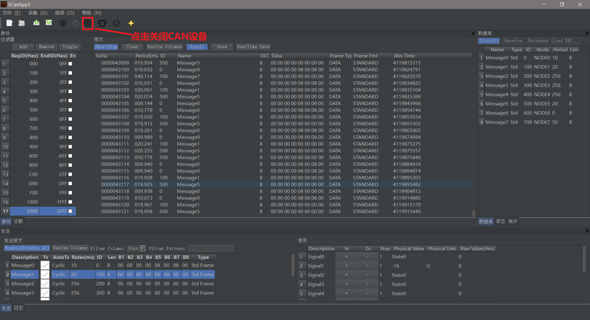
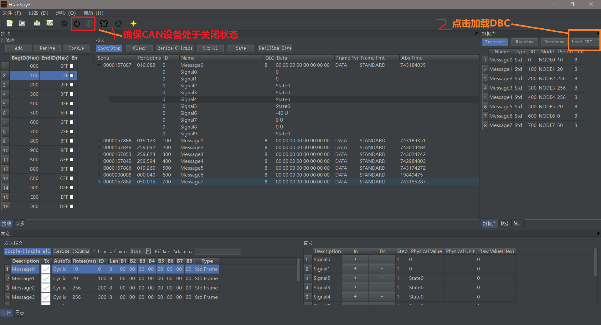
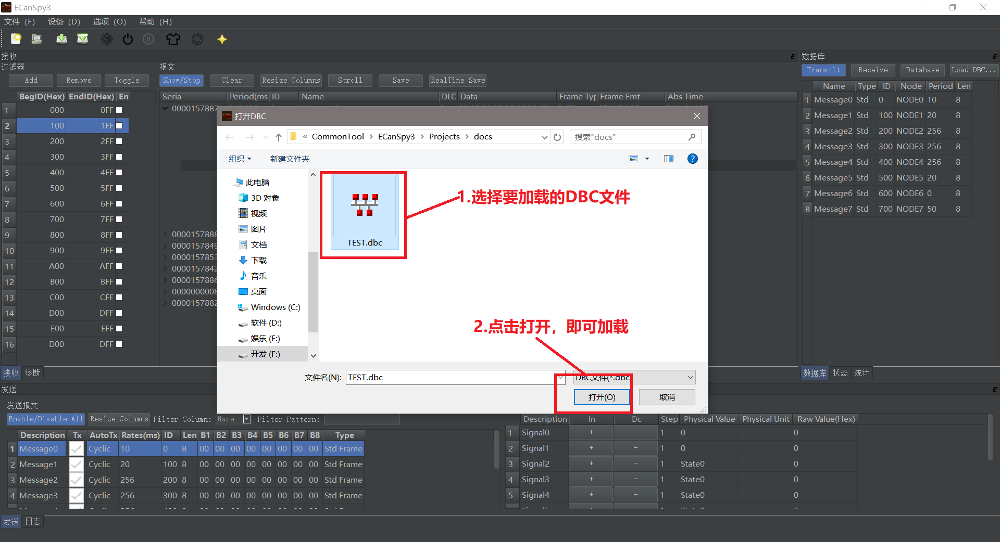
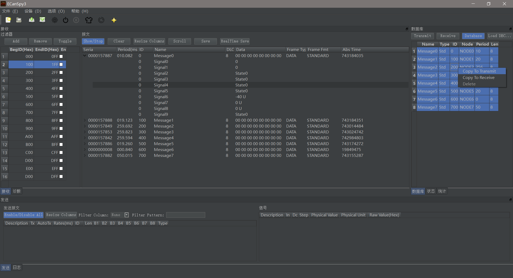

# ecanspy3

## 基本功能

ecanspy3是一个类似于VehicleSpy3的一款应用软件，主要功能是进行CAN总线测试。

## 功能列表

当前版本的ecanspy3支持以下功能：

+ 支持广成科技的USB CAN盒作为CAN输入输出设备
+ 支持加载dbc，并且自动解码CAN总线上的信息
+ 支持发送多个报文，并且提供比较友好的界面来改变要发送报文中的信号值
+ 支持周期性发送和触发性发送
+ 支持报文接收报文的软件滤波
+ 支持接收报文有滚动和更新模式，在滚动模式下，可以看多所有的数据，在更新模式下可以看到最新数据
+ 支持接收报文的树状显示，顶层级别显示报文信息，叶子级别显示解码后的信号信息
+ 支持数据保存功能，注意数据保存最多只能保存最新的30万条信息
+ 支持实时保存功能
+ 支持主题切换，当前支持两套主题，一套是默认主题，一套是黑色炫酷主题
+ 支持项目相关操作（新建项目，保存项目，另存为项目）

## 性能优势

+ 报文发送周期误差可以控制在10ms之内
+ 总线上即使很高，CPU使用率也不会很高(更新模式：实测在4%左右, 滚动模式下：实测不超过10%)，内存占用也是确定的，
+ 可以显示的最新报文数目为35万条
+ 接收显示的数据量即使非常大(35万条)，可以做到滑动自如，不卡屏

## 软件快照

1. 白色主题

滚动模式

更新模式

2. 黑色主题

滚动模式

更新模式

## 使用指导

### 前置步骤

1. 因为本程序支持的CAN设备是广成科技的CAN设备，所以你需要有个广诚科技的USB CAN盒

2. 安装号USB CAN盒驱动，并且和电脑连接起来

### 软件使用步骤

1. 点击工具按钮关闭CAN设备，只有在CAN设备关闭的情况下，才可以进行后续操作(解释下为什么使CAN设备默认开启，因为此程序带有项目保存功能，当下次启动的适合
，会自动加载上次的项目, 所以就不需要再次进行配置了，直接使用就行了)，如下图所示：

2. 加载DBC文件（这个是信号编码和解码的前提，并且发送操作也是依赖这一步骤）, 入下图所示：

首先，点击加载DBC按钮

然后，选择要加载的DBC文件, 点击打开

3. 选中要发送的报文，然后右键弹出菜单，选择copy to transmit，入下图所示：

当执行第三步后，会在整个窗口的发送面板中加载所选择的发送报文信息，并且发送面板中的信号窗体中会自动显示当前报文的所有信号

[!usage-step32](./docs/usage-step32.png "显示所有要发送的报文")

4. 启动CAN设备, 如下图所示：

[!usage-step4](./docs/usage-step4.png "启动CAN设备")

5. 如果想发送哪个报文，值需要将对应报文的CheckBox选中，即可
[!usage-step5](./docs/usage-step5.png "发送报文")

6. 如果想改变哪个信号的值，只需要点击发送面板中，信号窗口中的对应信号的相关单元格（附加说明：+，-按钮，物理值单元个和原始值单元值，都可以改变信号的值，并且对于有物理含义
的信号，可以直接在物理信号单元格中输入你想输入的物理值，内部有算法找到一个最接近的值）

点击+/-按钮修改信号值

[!usage-step61](./docs/usage-step61.png "点击+/-按钮修改信号值")

点击物理值单元格来信号值

[!usage-step62](./docs/usage-step62.png "直接输入物理值来改变信号值")

[!usage-step63](./docs/usage-step63.png "直接选中物理值状态来改变信号值")

## 项目结构介绍

### 1. dbc4cpp文件夹 

此文件夹是解析dbc库的项目文件夹，此项目最新产生dbc4cpp.a dbc4cpp.dll文件

此库内部因为实现考虑使用者就是ecanspy3 QT程序，所以内部容器就是使用QT库内的容器库，所以此库目前仅支持QT程序，不能用于普通的c++程序中。

### 2. dbc4cpp_test文件夹

此文件夹使dbc4cpp库的一个使用demo项目，所以如何使用dbc4cpp.dll可以参考此文件夹

### 3. ecanspy3文件夹

此文件夹是主项目QT工厂所在的目录，此项目最新产生可执行的ecanspy3.exe文件

本应用软件使用QT进行界面开发，内部主要使用view + model, 保证在总线负载很大的情况下，也不会占用太多的资源。

感兴趣的同学，可以先熟悉下QT库，然后在参与项目的开发

### 4. dist文件夹

此文件夹包含每个版本的最终释放的程序，其中每个版本文件夹下都有两个文件夹，一个叫packaged, 一个叫unpackaged, 现在说下区别：

+ packaged 这个文件夹下只有一个文件ecanspy3.exe程序，这个程序使打包后的程序。使用这个程序后，你不需要考虑有没有缺XXX.dll文件了, 但是它有个劣势，其占用的内存会偏多
+ unpackaged 这个文件夹下只会一个ecanspy3.exe文件，还有好多其他的dll文件，你如果使用此文件夹下的ecanspy3.exe的话，那么需要就此文件夹下对应的dll文件也拷贝过去，这样才
不会运行出错，这儿虽然拷贝不太方便，但是它相对于前者的优势是内存占用正常，不会偏多

总结 packaged文件夹下的程序拷贝（安装）方便，运行时内存占用偏高；unpackaged文件夹下的程序拷贝（安装）不方便，很容易出现缺少XXX.dll文件的问题，但是运行时内存相比较于前者
会少很多。推荐packaged下的程序

## 致谢
+ 感谢QT库
+ 感谢Vector公司的发明DBC文件格式
+ 感谢dracula项目
